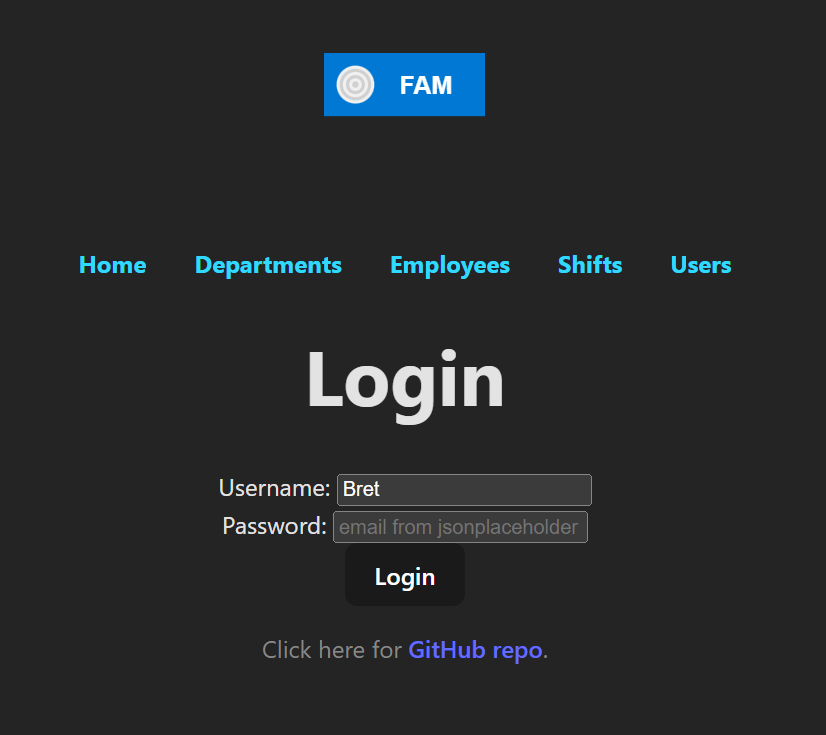
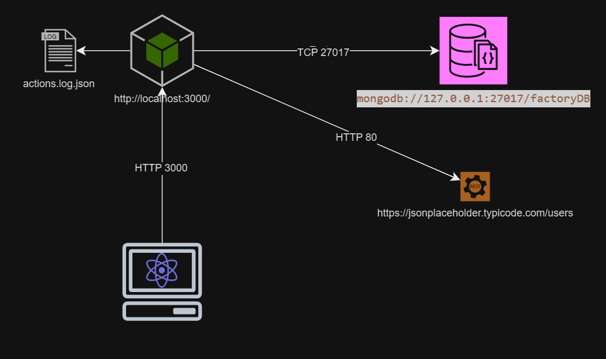
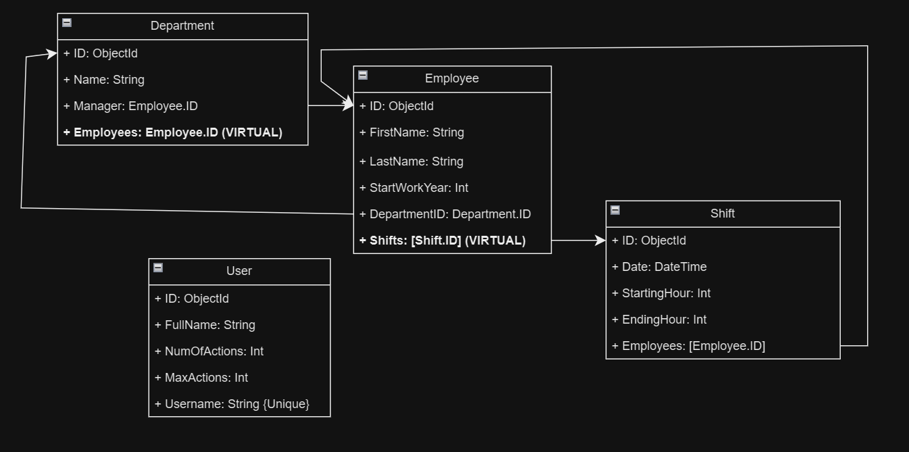

# FAM - Factory Management

Node JS Project of Factory Management System called "FAM"
With a React Client for demonstration.

Instructions how to setup server: [server/README.md](server/README.md)

Instructions how to setup react client: [client/README.md](client/README.md)

Mockup images with design notes and react app images can be found here: [images](images)

Infrastructure plan:

DB Relations:

